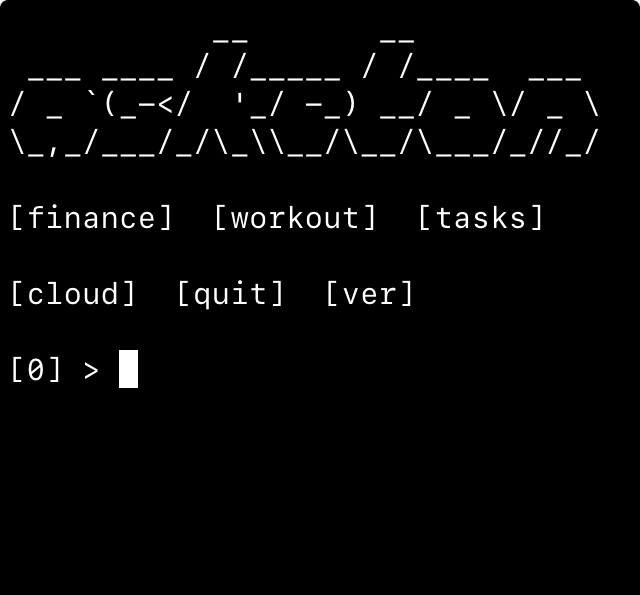

# [a]sketon - Life Tracker in the CLI

<div>
  
</div>

## Setup & Requirements

### Prerequisites
Regardless of your platform, asketon requires the following core components:

* Python 3.9+
* SQLite3
* Git

### Installation
Run the command corresponding to your operating system to ensure all dependencies are met:

| Operating System | Command |
|-----|---|
| iSH / Alpine | `apk update && apk add git python3 sqlite` |
| Ubuntu / Debian / WSL | `sudo apt update && sudo apt install git python3 sqlite3` |
| macOS (Homebrew) | `brew install git python sqlite` |
| Android (Termux) | `pkg install git python sqlite-utils` |

### Getting Started

1. Clone the repository:
```Bash
git clone git@github.com:te-nk/asketon.git
```
2. Run the application:
```Bash
python3 src/app.py
```

### Quick Access (Global Alias)
To launch asketon from any directory without manually switching paths, add an alias to your shell configuration (`.bashrc`, `.zshrc`, or `.profile`):

1. Open your config file:
```Bash
nano ~/.bashrc
```

2. Add the following line at the end:
```Bash
alias asketon="(cd ~/asketon/src && python3 app.py)"
```

3. Reload the configuration:
```Bash
source ~/.bashrc
```
Now you can simply type `asketon`.

### Private Backup & Persistence
To enable the automated cloud backup system while keeping your data private:

* Rebind the remote origin to your own private repository:
```Bash
git remote set-url origin git@github.com:your-username/your-private-repo.git
```
Ensure your SSH keys are correctly configured in your local environment for seamless authentication.

## Environment-Specific Tuning
1. Timezone Synchronization (iSH/Alpine)

By default, the iSH emulated environment uses UTC+0.
* For iSH: Adjust the `timedelta` value in `src/logger.py` and `src/actions/finance`, `src/actions/cloud` to match your local offset.
* For Desktop Linux/WSL: Remove or zero out the `timedelta` as the system clock is handled by the host OS.

2. Network Self-Healing (DNS Fix)

The backup module includes a "brute-force" DNS recovery tool to handle unstable Wi-Fi connections in emulated environments.
* Requirement: Root privileges are required to modify `/etc/resolv.conf`.
* Issue: If running without sudo or root, the DNS auto-patcher will raise a `Permission Denied error`.
